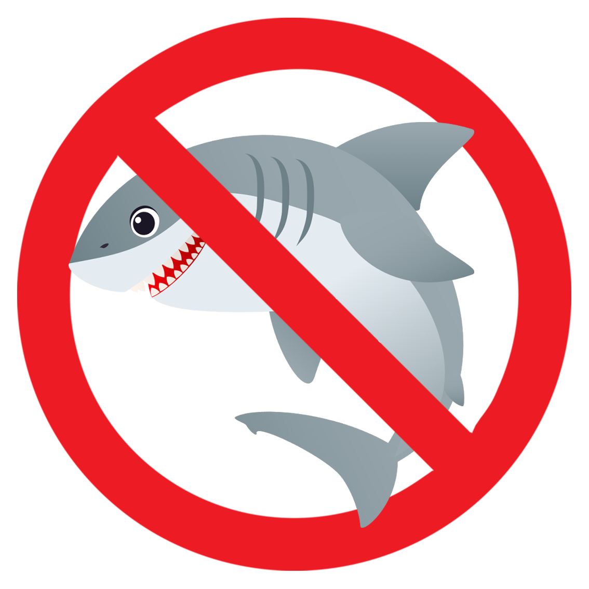

<a name="readme-top"></a>


<!-- PROJECT LOGO -->
<br />
<div align="center">
  <a href="https://github.com/superyassh/antishark">
    
  </a>

  <h3 align="center">Anti Shark</h3>

  <p align="center">
    A Decentralize Crowdfunding Platform
    <br />
    <a href="https://github.com/superyassh/antishark"><strong>Explore the docs »</strong></a>
    <br />
    <br />
    <a href="https://github.com/superyassh/antishark">View Demo</a>
    ·
    <a href="https://github.com/superyassh/antishark/issues">Report Bug</a>
    ·
    <a href="https://github.com/superyassh/antishark/issues">Request Feature</a>
  </p>
</div>


<!-- TABLE OF CONTENTS -->
<details>
  <summary>Table of Contents</summary>
  <ol>
    <li>
      <a href="#about-the-project">Problem Statement and Necessity</a>
      <ul>
        <li><a href="#built-with">Built With</a></li>
      </ul>
    </li>
    <li>
      <a href="#getting-started">Getting Started</a>
      <ul>
        <li><a href="#prerequisites">Prerequisites</a></li>
        <li><a href="#installation">Installation</a></li>
      </ul>
    </li>
    <li><a href="#usage">Usage</a></li>
    <li><a href="#contributing">Contributing</a></li>
    <li><a href="#contact">Contact</a></li>
    <li><a href="#acknowledgments">Acknowledgments</a></li>
  </ol>
</details>


<!-- ABOUT THE PROJECT -->
### Problem Statement and Necessity


Crowdfunding is one of the most popular ways to raise funds for any project, cause or for helping any individual in need. With the onset of Covid we have seen a rise in Crowdfunding activities across the globe which includes small campaigns to help people get oxygen and medical help to large funds such as PM Cares.

The major problems with the Current Crowdfunding Platforms that we wanted to solve were : 
- Security : As the funds become larger, they need to be heavily secure, although stringent measures such as symmetric encryption are in place to make e-payment safe and secure,it is still vulnerable to hacking. Blockchain — which has never been compromised yet — can provide that level of security.
- Transparency and Anti-Fraud  : We have seen, and continue to see a lot of crowdfunding scams happening around. There is no way to see where the funds are being used. We wanted to make the entire flow of funds transparent at every stage, so that there is no possibility of the money being misused.
- Global contribution : With some of the platforms being country specific, it becomes hard for people from other countries to contribute to various campaigns. Using blockchain anyone in the world can contribute to the campaign. Transactions are quick and convenient.

We were highly inspired by the CryptoRelief initiative ([www.cryptorelief.in](https://www.cryptorelief.in))  which raised ~1 billion dollars for Covid Relief in India from the entire global community, in a highly transparent manner. 

<p align="right">(<a href="#readme-top">back to top</a>)</p>


### Screenshots

#### Home Page :
![homepage-screenshot]
### Create Campaign Page :
![create-campaign-screenshot]
### Campaign Page :
![campaign-screenshot]
### New Withdrawal Request Page :
![new-withdrawal-request-screenshot]
### Withdrawal Request Page :
![withdrawal-request-screenshot]

<p align="right">(<a href="#readme-top">back to top</a>)</p>


### Built With

This section should list any major frameworks/libraries used to bootstrap your project. Leave any add-ons/plugins for the acknowledgements section. Here are a few examples.


* [![React][React.js]][React-url]
* [![Chakra][Chakra]][Chakra-url]
* [![Solidity][Solidity]][Solidity-url]
* [![Web3.js][Web3.js]][Web3.js-url]
* [![Vercel][Vercel]][Vercel-url]
* [![Ethereum][Ethereum]][Ethereum-url]


<p align="right">(<a href="#readme-top">back to top</a>)</p>


<!-- GETTING STARTED -->
## Getting Started

Here have the instruction to run the web app locally.

### Prerequisites


* npm
  ```sh
  npm install npm@latest -g
  ```
* yarn
  ```sh
  npm install --global yarn
  ```
* Node
* Metamask Plugin and Account


### Installation


1. Fork/Clone the Project
   ```sh
   git clone https://github.com/superyassh/antishark.git
   ```
2. Install all the dependencies
   ```sh
   yarn install
   ```
3. Run the application locally
   ```sh
   yarn dev
   ```
4. Create an account on [https://infura.io](https://infura.io/)
5. Create .env file in Ethereum directory and add these line to it.
   ```js
   mnemonic = 'Your mnemonic code'
   link = 'Your infura end point link '
   ```
6. Do the Changes that you want to do inside the Solidity File
7. Compile the Contract 
   ```sh
   node compile.js
   ```
8. Deploy Contract by going into smart-contract Directory and run.
   ```sh
   node deploy.js
   ```
9. Copy the contract deploy address and replace it in factory.js file.
  
10. Replace your "infura end point link" in web3.js file

<p align="right">(<a href="#readme-top">back to top</a>)</p>


## Usage

1. Connect Metamask to our Webj3 app.
2. If you want to create your own Campaign then fill all the details in create Campaign page or if you want to contribute to any Campaign just go to that Campaign and contribute whatever amount you want.

<p align="right">(<a href="#readme-top">back to top</a>)</p>


<!-- CONTRIBUTING -->
## Contributing

Contributions are what make the open source community such an amazing place to learn, inspire, and create. Any contributions you make are **greatly appreciated**.

If you have a suggestion that would make this better, please fork the repo and create a pull request. You can also simply open an issue with the tag "enhancement".
Don't forget to give the project a star! Thanks again!

1. Fork the Project
2. Create your Feature Branch (`git checkout -b feature/AmazingFeature`)
3. Commit your Changes (`git commit -m 'Add some AmazingFeature'`)
4. Push to the Branch (`git push origin feature/AmazingFeature`)
5. Open a Pull Request

<p align="right">(<a href="#readme-top">back to top</a>)</p>


<!-- CONTACT -->
## Contact

[![Gmail][gmail]][gmail-url] [![Twitter][Twitter]][twitter-url] [![LinkedIn][linkedin-shield]][linkedin-url] [![Github][Github]][Github-url]

Project Link: [https://github.com/superyassh/antishark](https://github.com/superyassh/antishark)

<p align="right">(<a href="#readme-top">back to top</a>)</p>


<!-- ACKNOWLEDGMENTS -->
## Acknowledgments

Use this space to list resources you find helpful and would like to give credit to. I've included a few of my favorites to kick things off!

* [Choose an Open Source License](https://choosealicense.com)
* [GitHub Emoji Cheat Sheet](https://www.webpagefx.com/tools/emoji-cheat-sheet)
* [Malven's Flexbox Cheatsheet](https://flexbox.malven.co/)
* [Malven's Grid Cheatsheet](https://grid.malven.co/)
* [Img Shields](https://shields.io)
* [GitHub Pages](https://pages.github.com)
* [Font Awesome](https://fontawesome.com)
* [React Icons](https://react-icons.github.io/react-icons/search)

<p align="right">(<a href="#readme-top">back to top</a>)</p>


<!-- MARKDOWN LINKS & IMAGES -->
<!-- https://www.markdownguide.org/basic-syntax/#reference-style-links -->

[linkedin-shield]: https://img.shields.io/badge/-LINKEDIN-blue?style=for-the-badge&logo=linkedin
[linkedin-url]: https://linkedin.com/in/superyassh
[product-screenshot]: images/screenshot.png
[homepage-screenshot]: images/homepage.png
[create-campaign-screenshot]: images/Create_Campaign.png
[campaign-screenshot]: images/Campaign_Page.png
[new-withdrawal-request-screenshot]: images/New_Withdrawal_Request.png
[withdrawal-request-screenshot]: images/Withdrawal_Request.png
[React.js]: https://img.shields.io/badge/React-20232A?style=for-the-badge&logo=react&logoColor=61DAFB
[React-url]: https://reactjs.org/
[Chakra]: https://img.shields.io/badge/chakra-%234ED1C5.svg?style=for-the-badge&logo=chakraui&logoColor=white
[Chakra-url]: https://chakra-ui.com/
[Solidity]: https://img.shields.io/badge/Solidity-%23363636.svg?style=for-the-badge&logo=solidity&logoColor=white
[Solidity-url]: https://soliditylang.org/
[Web3.js]: https://img.shields.io/badge/web3.js-F16822?style=for-the-badge&logo=web3.js&logoColor=white
[Web3.js-url]: https://www.web3labs.com/web3j-sdk
[Vercel]: https://img.shields.io/badge/vercel-%23000000.svg?style=for-the-badge&logo=vercel&logoColor=white
[Vercel-url]: https://vercel.com/
[Ethereum]: https://img.shields.io/badge/Ethereum-3C3C3D?style=for-the-badge&logo=Ethereum&logoColor=white
[Ethereum-url]: https://ethereum.org/en/
[Gmail]: https://img.shields.io/badge/Gmail-D14836?style=for-the-badge&logo=gmail&logoColor=white
[gmail-url]: mailto:realsuperyash@gmail.com
[Twitter]: https://img.shields.io/badge/Twitter-%231DA1F2.svg?style=for-the-badge&logo=Twitter&logoColor=white
[twitter-url]: https://twitter.com/superyassh
[GitHub]: https://img.shields.io/badge/github-%23121011.svg?style=for-the-badge&logo=github&logoColor=white
[Github-url]: https://github.com/superyassh